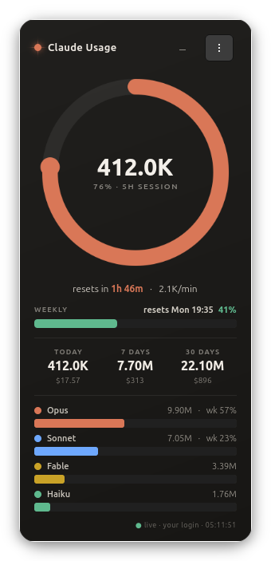

# Claude Usage Widget

A small, dark desktop widget for Linux that shows your **Claude usage** at a
glance — the same numbers as Claude Code's `/usage` panel, living right on
your desktop.


[](LICENSE)

<p align="center">
  
  <br>
  <sub><em>Simulated demo data — regenerate with <code>tools/demo_shot.py</code></em></sub>
</p>

## What it shows

- **5-hour session** — a ring with your real session-limit % from your Claude
  account, the tokens used in that window, time until it resets, and your
  current burn rate
- **Weekly limit** — the all-models weekly bar, plus Opus / Sonnet sub-limits
  when your plan has them
- **Token totals** for today / 7 days / 30 days, with estimated cost
- **Per-model breakdown** over the last 30 days (Opus / Sonnet / Haiku / Fable)
- **GNOME top-bar indicator** — your session % stays in the panel even when
  the widget is hidden

The limit percentages and reset times come from the same API Claude Code's
`/usage` panel uses, so they match it exactly. Token counts and costs are
computed locally from your Claude Code logs (`~/.claude/projects`).

## Supported systems

| | |
|---|---|
| **OS** | Linux (no macOS / Windows) |
| **Desktop** | any GTK4-capable desktop; developed and tested on Ubuntu 25.10 / GNOME 49 (Wayland) |
| **Top-bar indicator** | GNOME Shell 45–49 — optional, the widget works without it |
| **Dependencies** | PyGObject, GTK 4, pycairo — auto-installed via apt / dnf / pacman / zypper |
| **Python** | 3.10+ |

The "desktop widget" behaviour (no taskbar / Alt-Tab entry, visible on all
workspaces) works on X11 and XWayland — on GNOME Wayland this happens
automatically. On a setup without XWayland the widget runs as a normal window.

## Install

```bash
git clone https://github.com/kirilldop/claude-usage-widget.git
cd claude-usage-widget
./install.sh
```

The installer:

- installs the GTK dependencies if missing (the only step that asks for sudo),
- copies the app to `~/.local/share/claude-usage-widget`,
- adds a launcher, an app-menu entry and an autostart entry (starts on login),
- installs the GNOME top-bar extension (GNOME only; on Wayland it appears
  after you log out and back in),
- starts the widget.

Re-run `./install.sh` any time to update. Nothing outside your home directory
is touched.

## Connect your Claude account

On first run click **"Connect your Claude account"**, approve access in the
browser, and paste the code Claude shows you. That's it — the widget refreshes
its token automatically from then on.

If you already use **Claude Code**, there is nothing to do: the widget picks
up its login automatically.

## Everyday use

| Action | How |
|---|---|
| Move | drag the card anywhere (position is remembered) |
| Hide | **Esc** or the **—** button — keeps running in the background |
| Reopen | top-bar indicator → *Open full widget*, or launch "Claude Usage Widget" from your apps |
| Resize | **Ctrl + scroll** on the card, or **Ctrl +/−/0** (70–160 %, remembered) |
| Quit | **⋯** menu → *Quit* |

The footer shows where the data is coming from:

| Footer | Meaning |
|---|---|
| `● live` | connected — real account data |
| `◑ offline / rate-limited · cached` | temporarily unreachable — showing the last real data |
| `○ … · estimate` | no recent real data — local estimate from your logs |
| `⚠ session expired / not connected` | click the banner to (re)authorize |

## What the numbers mean

Token counts show **real tokens only** (input + output). Cache reads/writes
are excluded — they inflate totals ~100× without telling you much. The `$`
figures, however, are computed from the **full** usage including cache, at
public API per-MTok prices: on a Pro/Max subscription that's a *"tokens worth
~$X"* indicator, not a real charge.

## Configuration (optional)

The real limits come from your account, so normally there is nothing to
configure. To override the **fallback estimate** limits (used only when the
account data is unavailable), create `~/.config/claude-usage-widget.json`:

```json
{ "block_limit": 50000000, "weekly_limit": 1500000000 }
```

Values are token counts. Note: the local weekly fallback counts calendar
weeks (Mon–Sun), while the real account window is a rolling 7 days — the
fallback is an approximation by design.

## Uninstall

```bash
./uninstall.sh          # remove the widget, keep your login
./uninstall.sh --purge  # also delete the saved login
```

## Privacy & security

- Everything runs locally and there is **no telemetry**. The only network
  calls go to Anthropic's own usage endpoint (the one Claude Code's `/usage`
  uses), and they are read-only.
- You authorize **your own** account in the browser through Claude's official
  OAuth client (PKCE); the widget never sees your password.
- Tokens are stored with `0600` permissions in
  `~/.config/claude-usage-widget/`. Claude Code's own credentials, when used
  as a fallback, are read-only — never modified.

## Project layout

```
├── install.sh / uninstall.sh   # installer & remover (re-run install to update)
├── src/
│   ├── widget.py               #   GTK4 window (UI)
│   ├── usage_core.py           #   log parsing, metrics, account API, caches
│   ├── auth.py                 #   OAuth (PKCE login, token refresh, stores)
│   ├── statusd.py              #   headless updater for the panel indicator
│   └── x11hints.py             #   EWMH desktop-widget hints (X11/XWayland)
├── gnome-extension/            # top-bar indicator (GNOME Shell 45+)
├── assets/                     # app icon + README screenshot
└── tools/                      # make_icon.py (icon), demo_shot.py (screenshot)
```

## License

[MIT](LICENSE)
